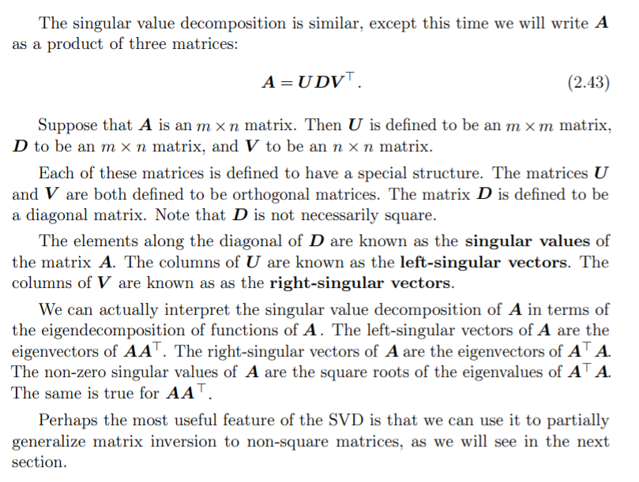
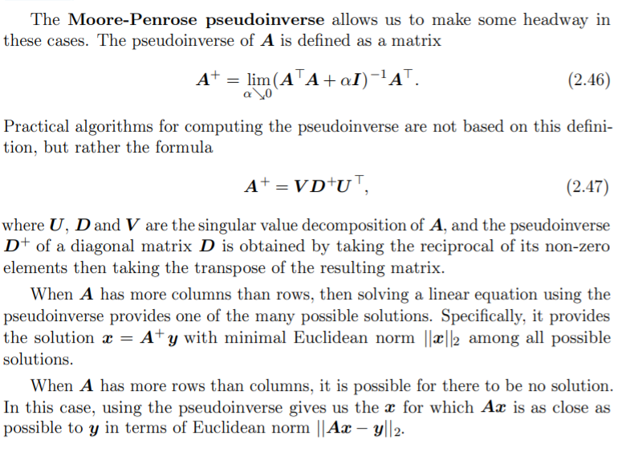

# Linear Algebra

## Scalars, Vectors, Matrices and Tensors

- __Scalars__: A scalar is just a single number.
- __Vectors__: A vector is an array of numbers. The numbers are arranged in order. We can identify each individual number by its index in that ordering.
- __Matrices__: A matrix is a 2-D array of numbers, so each element is identified by two indices instead of just one. 
- __Tensors__: In some cases we will need an array with more than two axes. In the general case, an array of numbers arranged on a regular grid with a variable number of axes is known as a tensor.

One important operation on matrices is transpose.

## Multiplyinh Matrices and Vectors

- Matrix Product : C=AB
- element-wise product or Hadamard product
- dot product

__read about properties of matrices__

## Identity and Inverse Matrices

$ A^{-1}.A=I$

- $A^{-1}$ is the inverse of A.
- I is identity matrix.

## Linear Dependance and Span

- chapter 3 and chapter 4 of Introduction Linear Algebra by Gilbert Strang

## Norms

Sometimes we need to measure the size of a vector. In machine learning, we usually
measure the size of vectors using a function called a norm. Formally, the L
p norm
is given by

$ ||x||_p = (\sum_i{|x_i|^p})^{\frac{1}{p}}$

Norms, including the L
p norm, are functions mapping vectors to non-negative
values. On an intuitive level, the norm of a vector x measures the distance from
the origin to the point x. More rigorously, a norm is any function f that satisfies
the following properties:
- f (x) = 0 ⇒ x = 0
- f (x + y) ≤ f(x) + f (y) (the triangle inequality)
- ∀α ∈ R, f (αx) = |α|f (x)

The L
2 norm, with p = 2, is known as the Euclidean norm. It is simply the
Euclidean distance from the origin to the point identified by x. The L
2 norm is
used so frequently in machine learning that it is often denoted simply as ||x||, with
the subscript 2 omitted. It is also common to measure the size of a vector using
the squared L
2 norm, which can be calculated simply as $x^Tx$.

The L
1 norm is commonly used in machine learning when the difference between
zero and nonzero elements is very important. Every time an element of x moves
away from 0 by $\epsilon$, the L
1 norm increases by $\epsilon$.

Some other norms are:
- max norm
- Frobenius norm : For measuring the size of a matrix (analogous to L2 norm)

## Special Kinds of Matrices and Vectors

- Diagonal Matrices : Self Explanatory
- Symmetric matix : $A=A^T$
- Unit vector
- Orthogonal Matrix : $ A^T.A=A.A^T=I$
- orthonormal vectors : $x^T.y=0$

## Eigendecomposition

Much as we can discover something about the true nature of an integer by
decomposing it into prime factors, we can also decompose matrices in ways that
show us information about their functional properties that is not obvious from the
representation of the matrix as an array of elements.

One of the most widely used kinds of matrix decomposition is called eigendecomposition, in which we decompose a matrix into a set of eigenvectors and
eigenvalues.

An eigenvector of a square matrix A is a non-zero vector v such that multiplication by A alters only the scale of v:
Av = λv.

The scalar λ is known as the eigenvalue corresponding to this eigenvector

The eigendecomposition of A is then given by
A = $V diag(λ)V^{−1}$.
where V is the Eigenvector Matrix

Not every matrix can be decomposed into eigenvalues and eigenvectors. In some cases, the decomposition exists, but may involve complex rather than real numbers. Fortunately, in this book, we usually need to decompose only a specific class of
matrices that have a simple decomposition. Specifically, every real symmetric
matrix can be decomposed into an expression using only real-valued eigenvectors
and eigenvalues:

$ A=QΛQ^T $
where Q is the orthogonal matrix composed of eigenvectors of A and Λ is a diagonal matrix.

While any real symmetric matrix A is guaranteed to have an eigendecomposition, the eigendecomposition may not be unique. If any two or more eigenvectors
share the same eigenvalue, then any set of orthogonal vectors lying in their span
are also eigenvectors with that eigenvalue, and we could equivalently choose a Q
using those eigenvectors instead. By convention, we usually sort the entries of Λ
in descending order. Under this convention, the eigendecomposition is unique only
if all of the eigenvalues are unique.

A matrix whose eigenvalues are all positive is called positive definite. A
matrix whose eigenvalues are all positive or zero-valued is called positive semidefinite. Likewise, if all eigenvalues are negative, the matrix is negative definite, and
if all eigenvalues are negative or zero-valued, it is negative semidefinite. Positive
semidefinite matrices are interesting because they guarantee that $∀x, x^TAx ≥ 0$. Positive definite matrices additionally guarantee that $x^TAx = 0 ⇒ x = 0$.

## SVD : Singular Value Decomposition

The singular value decomposition (SVD) provides another way to factorize
a matrix, into singular vectors and singular values. The SVD allows us to
discover some of the same kind of information as the eigendecomposition.

Every real matrix has a singular value
decomposition, but the same is not true of the eigenvalue decomposition.

## The Moore-Penrose Pseudoinverse

If A is taller than it is wide, then it is possible for Ax=b equation to have
no solution. If A is wider than it is tall, then there could be multiple possible
solutions.

## The Trace Operator

The trace operator gives the sum of all of the diagonal entries of a matrix:

$Tr(A) =\sum_iAi,i$.

The trace operator is useful for a variety of reasons. Some operations that are
difficult to specify without resorting to summation notation can be specified using matrix products and the trace operator. For example, the trace operator provides
an alternative way of writing the Frobenius norm of a matrix:

$||A||F = \sqrt{Tr(AA^T)}.$

__Read Propersties f Trace operator__

## The Determinant

The determinant of a square matrix, denoted det(A), is a function mapping
matrices to real scalars. The determinant is equal to the product of all the
eigenvalues of the matrix.

## Example PCA : Principal Component Analysis

One simple machine learning algorithm, principal components analysis or PCA
can be derived using only knowledge of basic linear algebra.

